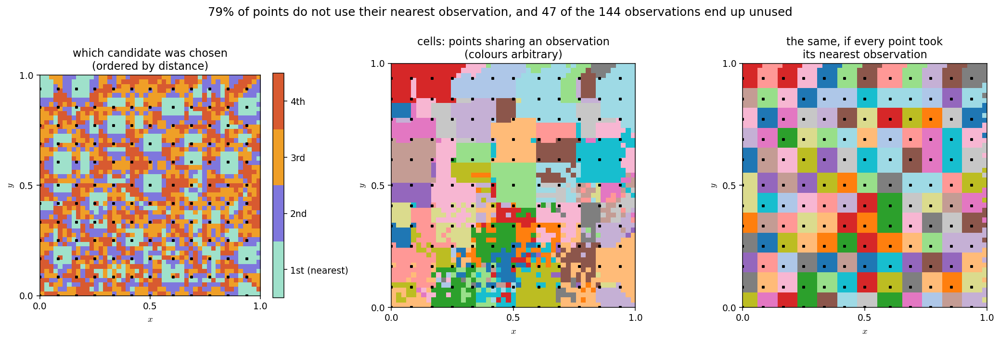
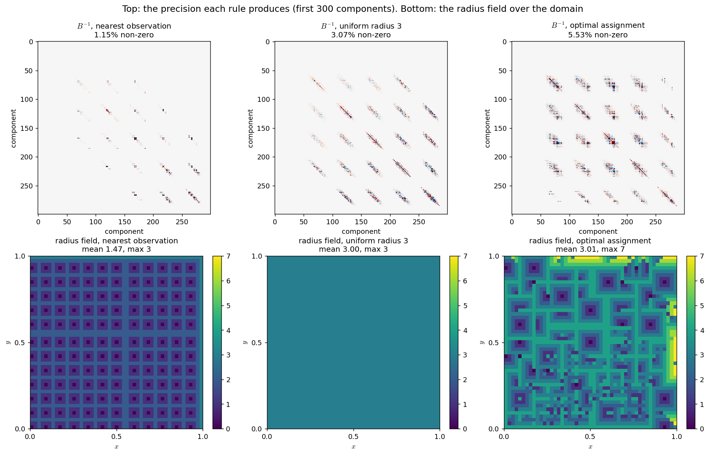
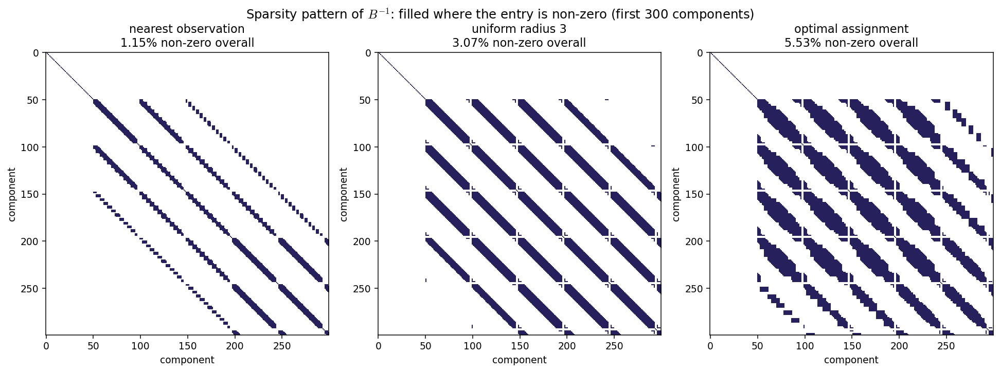
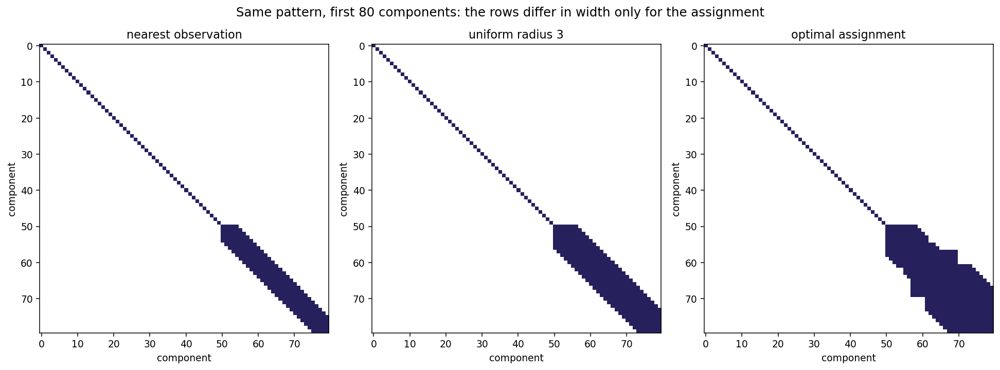
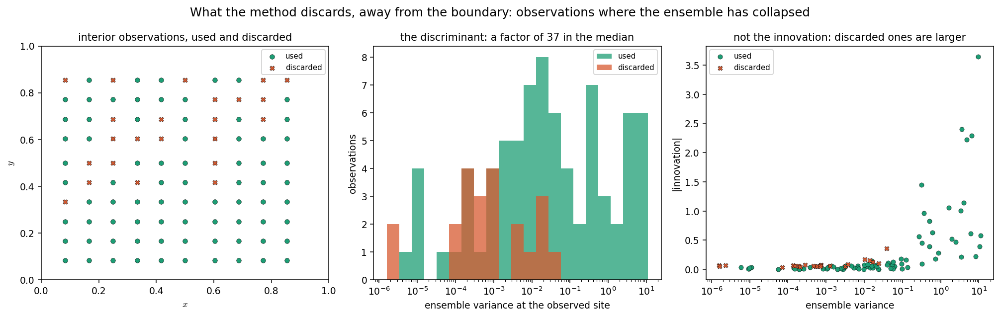
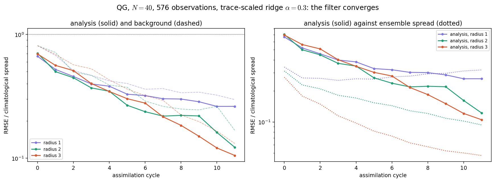

# Adaptive localization by observation assignment: findings

Handoff note. Everything below was measured on the quasi-geostrophic testbed
described at the end; nothing here is an estimate or an expectation.

---

## The idea

Replace the localization radius by an **assignment**. Each model component
grows a neighbourhood until it has collected $\kappa$ candidate observations,
and is then updated by **exactly one** of them, or by none. The radius is not
chosen: it is the distance to whichever observation the component ended up
using.

The cost of an assignment is the variational cost evaluated at the scalar local
analysis. For component $i$ assigned to observation $j$:

$$
x^{a}_{i} = x^{b}_{i} + \frac{\sigma_{ij}}{\sigma_{jj} + r_{j}}\big(y_{j} - x^{b}_{j}\big),
\qquad
J_i = \frac{(x^{a}_{i} - x^{b}_{i})^{2}}{\sigma_{ii}} + \frac{(y_{j} - x^{a}_{j})^{2}}{r_{j}}
$$

and $J_i = (y_j - x^b_j)^2 / r_j$ when the component abstains. The global score
is the mean, $J = \frac{1}{n}\sum_i J_i$.

No truth, nothing withheld, everything from ensemble anomalies. The assignment
then fixes the predecessor sets of a modified-Cholesky precision, assembled
once per cycle for a single global analysis.

---

## Findings

### 1. The nearest observation is usually the wrong one

**79% of components do not use their nearest observation.** With $\kappa = 4$
candidates ordered by distance, the choices split almost evenly:

| candidate | 1st (nearest) | 2nd | 3rd | 4th |
|---|---|---|---|---|
| components | 516 | 603 | 647 | 635 |

What decides is the ensemble correlation, not the distance. This is the central
result: a distance-based rule is choosing badly four times out of five.

The left panel colours each component by which candidate it took; all four are
spread over the whole domain. The middle and right panels are the comparison
worth putting in a paper: the tessellation the method produces against the
geometric one. Observations are the black squares. The real cells are irregular,
some observations take large regions and others none, and none of that is
visible from the geometry alone.

### 2. The cost separates good assignments from bad ones

| assignment | $J$ |
|---|---|
| every component abstains | 123.82 |
| every component takes its nearest | 0.587 |
| **optimal assignment** | **0.052** |
| random assignment | 30.28 |

The optimal assignment improves on the nearest-observation rule by a factor of
**eleven**.

### 3. The radius adapts to observation density with no parameter

| network | mean radius | max radius |
|---|---|---|
| regular lattice, spacing 4 | 2.75 | 4 |
| random, same overall density | 1.71 | 5 |

The random network gives a *smaller* mean and a *larger* maximum, because it
leaves both dense clusters and empty regions. Nothing controls this; it falls
out of growing the neighbourhood until $\kappa$ observations are found.

### 4. Same radius budget, different structure

Compared at equal mean radius (3.01 for the assignment, 3.00 for a uniform
radius of 3), the precision matrices differ:

| rule | mean radius | max radius | non-zero in $B^{-1}$ |
|---|---|---|---|
| nearest observation | 1.47 | 3 | 1.15% |
| uniform radius 3 | 3.00 | 3 | 3.07% |
| **optimal assignment** | **3.01** | **7** | **5.53%** |

The assignment does not spend more; it spends differently, concentrating long
radii where they help and short ones where they do not.

The bottom row is the clearest statement of it: a uniform radius is a flat
sheet, the assignment is a field with structure. The top row shows what that
does to the precision.

Structure only, filled where an entry is non-zero. The two left patterns are
bands of constant width, because the width *is* the radius and it does not
change from row to row. The right one varies.

At this zoom the rows are individually visible. The thin diagonal at the top
left is the Dirichlet boundary: `q` vanishes there, the ensemble has no
variance, and those components are not estimated at all. It appears in all
three because the boundary is the boundary whatever the localization rule.

### 5. The method discards observations where the ensemble has collapsed

Of 144 observations, **97 are used and 47 end up updating nothing**. Two checks
matter here:

**They were not excluded by construction.** All 47 were offered as candidates,
to between 39 and 101 components each (median 68), against a median of 68 for
all observations. They competed and lost everywhere.

**Part of it is a boundary artefact, part is real.** Of the 23 observations
sitting on the Dirichlet boundary, 15 are discarded — trivially, since $q$
vanishes there and the ensemble has no variance. Restricting to the 100
observations at distance $\ge 4$ from the boundary, **23 are still discarded**,
and the discriminant is stark:

| | used | discarded |
|---|---|---|
| ensemble variance at the site (median) | 0.0214 | 0.00058 |
| \|innovation\| (median) | 0.0385 | 0.0633 |
| mean correlation with its candidates | 0.476 | 0.556 |
| offered to N components | 69 | 68 |

A factor of **37 in the ensemble variance**, and nothing else discriminates:
the discarded observations have *larger* innovations and *higher* correlations,
and were offered just as often. The method rejects observations sitting where
the ensemble believes it already knows the answer — where the Kalman gain is
near zero and the observation could not move the analysis anyway. It finds this
with no rule telling it to.

### 6. The problem is separable, and therefore not combinatorial

$J$ is a mean of terms each depending only on its own component's choice, so
the optimum is obtained component by component, in closed form. Verified:
tabu search at $2\times10^{5}$ evaluations and simulated annealing at
$1.6\times10^{4}$ both return the greedy solution to every digit
($J = 0.052148$ for all three).

This is a virtue operationally and a limitation scientifically. It means the
formulation as posed does not exercise combinatorial structure. Coupling
neighbouring components — penalizing roughness in the analysis increment, or
capping how many components one observation may update — would break the
decomposition. Whether that coupling *improves the analysis*, rather than
merely making the optimization harder, is the open question.

### 7. The ridge penalty must be scaled, and nothing worked until it was

This one corrects an error that invalidated every error measurement taken
before it, and is the reason the filter appeared not to work at all.

The modified-Cholesky estimator regresses each component on its predecessors
with a ridge penalty. That penalty was applied **absolutely**, which is what
pyteda does and what `sklearn.Ridge` expects. In model units the variance of
$q$ is of order $10^{7}$, so `alpha = 0.01` sits fifteen orders of magnitude
below the diagonal of $X^{\top}X$ and regularizes nothing. With a small
ensemble the regression then interpolates its predecessors exactly, the
residual variance is rounding noise, and its inverse -- which *is* the diagonal
of the precision -- explodes.

Measured, at $N = 12$:

| | value |
|---|---|
| median diagonal of $B^{-1}$ | 2059 |
| median inverse ensemble variance | $2.25\times10^{-6}$ |
| ratio | $9\times10^{8}$ |

The filter was being told the background is a billion times more certain than
the ensemble says it is, so it ignored every observation. The symptom was
unmistakable once looked at directly: **with 576 observations fifteen times
more precise than the background, no radius improved on the background at all**
--- radius 1 was 1.6% worse, radius 3 was 38% worse. The same happened through
pyteda's own analysis routine, which is how the estimator, rather than the
implementation, was identified as the problem.

Scaling the penalty by the trace, $a = \alpha \cdot \mathrm{tr}(X^{\top}X)/p$,
brings the diagonal back to the order of the inverse ensemble variance and the
analysis starts improving the background.

### 8. With the ridge fixed and a large enough ensemble, the filter converges

Twelve cycles, $N = 40$, 576 observations on a lattice shifted each cycle,
$\alpha = 0.3$ scaled. RMSE as a fraction of the climatological spread:

| radius | cycle 0 | cycle 11 | final ensemble spread |
|---|---|---|---|
| 1 | 0.666 | 0.262 | 0.319 |
| 2 | 0.705 | 0.122 | 0.094 |
| 3 | 0.696 | **0.105** | 0.047 |

The error falls monotonically for all three, by a factor of eight at radius 3.
Two things are worth reading off this table beyond the headline.

**The optimal radius grows with the ensemble.** At $N = 12$ only radius 1
improved anything; at $N = 40$ radius 3 is best. That is the expected
behaviour and its absence was another symptom of the ridge problem.

**Radius 3 is converging on an under-dispersed ensemble.** Its spread, 0.047,
is less than half its error, 0.105, so it believes it knows more than it does;
radius 2 has spread 0.094 against error 0.122, which is the healthy relation.
The lowest error over twelve cycles is not automatically the right choice, and
this is exactly the trade-off a localization criterion should be capturing.

Left: analysis solid, background dashed, log scale. Right: analysis against
ensemble spread, which is where the under-dispersion at radius 3 is visible.

### 9. Cost

| operation | time |
|---|---|
| evaluate $J$ for a whole assignment | 0.016 ms |
| one evaluation requiring the full precision and solve | 180 ms |
| the same, at a radius that destroys sparsity ($r = 12$) | 1070 ms |

Four orders of magnitude. The candidate sets and covariances are precomputed
once per cycle; the search only reads them.

---

## Figures

All of them are in `figures/` and appear inline above, next to the finding each
one belongs to.

---

## Testbed

1.5-layer quasi-geostrophic model of Sakov and Oke (2008):

$$
q_t = -\psi_x - \varepsilon J(\psi,q) - A\triangle^{3}\psi + 2\pi\sin(2\pi y),
\qquad q = \triangle\psi - F\psi
$$

on the unit square, Dirichlet boundaries, $F = 1600$, $\varepsilon = 10^{-5}$,
RK4 at $dt = 0.3125$, $49\times49$ per field.

Four settings are consequences of measurements rather than choices, and each
cost real time to find:

**Dissipation ten times the package default.** At the default the norm of $q$
grows by a factor of fourteen between $t = 500$ and $t = 8000$ and never
saturates, so there is no stationary regime and no climatology to sample. At
$10^{-11}$ it settles: $1.107\times10^{4}$ at $t = 20000$ against
$1.222\times10^{4}$ at $t = 60000$. Sakov and Oke report the same.

**Only $q$ is estimated.** The model integrates $q$ and recovers $\psi$ from it
at every step, so an analysis correcting $\psi$ is discarded at the next
propagation. Verified directly: halving $\psi$ and leaving $q$ alone gives a
bit-identical propagation. The state is $q$ alone, $n = 2401$, and $\psi$ is
rebuilt from the analysed $q$.

**Climatological ensemble.** Members and truth drawn from snapshots of one long
run. Perturbing a state and propagating does not work: a perturbation is mostly
energy off the attractor and the hyperviscosity removes it. From 30% of
climatology the background error falls to 0.068 after 120 time units, a factor
of five, and raising the amplitude does not compensate. Only after ~250 units
does the surviving component grow, reaching 0.872 at $t = 1000$ — which is what
a climatological ensemble has from the start.

**$dt = 0.3125$, not 1.25.** At the larger step the forecast blows up when the
network is sparse and the radius short: the analysis corrects observed points
hard and leaves their neighbours alone, and the biharmonic term amplifies the
resulting gradients. The failure is in `propagate`, not in the analysis.
Configurations that still diverge are recorded rather than avoided — which
combinations of density and radius a scheme cannot survive is itself a result.

---

## Code

`qgloc/assignment.py` holds the whole method:

- `build_candidates(g, obs_rows, obs_cols, n_candidates, r_max)` — grows the
  neighbourhoods, returns candidates and their distances
- `LocalCost(DX, cand, obs_idx, y, xb, obs_var)` — precomputes the cost table;
  `.score(assignment)`, `.best_greedy()`, `.radius_field()`, `.assigned_obs()`
- `SEARCHES` — `greedy`, `nearest`, `tabu`, `annealing` over assignments

`qgloc/precision.py` builds the modified-Cholesky precision from a radius
field, with rows cached by `(component, radius)`. The ridge is scaled by the
trace of $X^{\top}X$ by default (`scale_ridge=True`, `alpha=0.3`); passing
`scale_ridge=False` reproduces pyteda's absolute penalty exactly, which is kept
only for the equivalence test. One open discrepancy after excluding boundary
components is documented there and marked `xfail`.

`CoupledCost` and `CoupledObjective` in `assignment.py` add the roughness
penalty that breaks separability. With it, tabu beats greedy by 0.65% at
$\lambda = 0.5$ and 50% at $\lambda = 100$, so the problem does become
combinatorial --- but a large $\lambda$ means optimizing a cost dominated by
the penalty rather than by the fit, and whether any intermediate value improves
the analysis is unmeasured, for the reason given under Open below.

---

## Open

- Does a coupling term (roughness penalty, or a cap on how many components one
  observation updates) improve the analysis, or only complicate the search?
  This is the second paper.
- **The assignment in the loop is written but only tested at a small ensemble.**
  `EXP-04-ASSIGNMENT` runs it against fixed radii 1, 2 and 3, sweeping the
  ensemble size over 40, 80 and 160. At smoke scale with N = 12 it diverges:
  the rule "grow until kappa observations are inside" lands on a mean radius of
  2.9, and at that ensemble size only radius 1 survives at all --- fixed radius
  3 also fails there. So the small-ensemble result says nothing about the
  method and everything about the pairing of radius and N, which is why the
  sweep exists. Whether it pays at 40 and above is the open measurement.
- **kappa is a localization parameter in disguise.** How many candidates a
  component collects determines the radius it ends up with, so kappa has to be
  compatible with the ensemble size in the same way a radius does. It is set to
  4 throughout and has not been swept.
- Everything measured before finding 7 that involved an analysis error is
  void, since the ridge was not regularizing. That includes the comparison of
  the coupled cost against the uncoupled one: it reported that coupling made
  the analysis worse, but it was measured through a broken filter and has to be
  repeated.
- The discarded-observation result is from one cycle and one ensemble; it needs
  repeating across cycles and seeds before it goes in a paper as stated.
